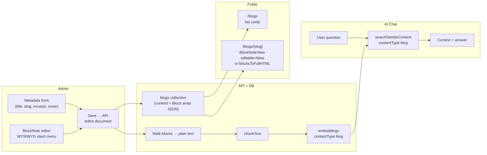

# Blogs Section: Full Plan (Notion-like WYSIWYG)

Add a configurable Blogs section with a Notion-like WYSIWYG admin: store posts as BlockNote block JSON in MongoDB, edit with BlockNote editor (no Markdown knowledge required), render on the frontend with BlockNote read-only view or static HTML, and chunk/store plain text in embeddings for AI chat.

---

## Why a block-based WYSIWYG (and how Notion does it)

You want the admin to be **as simple as Notion**: click, type, add headings/lists/images/code without writing Markdown. That means a **block-based WYSIWYG** where every piece of content is a block (paragraph, heading, list, image, code, etc.) that you edit in place.

**How Notion-style editors work (from public docs and BlockNote):**

- **Data model:** Everything is a **block**. Each block has: `id`, `type` (paragraph, heading, bulletedListItem, image, code, etc.), `content` (rich text: bold, links, etc.), and optional `children` (nested blocks). Text formatting is stored as structured data (e.g. bold/italic per span), not raw HTML.
- **Editing:** The editor uses contenteditable and custom logic; slash menu (`/`) to insert blocks, drag handles to reorder, toolbars for formatting. What you see is what you get.
- **Storage:** The document is an **array of block objects (JSON)**. Storing this in MongoDB is lossless and easy to re-load.

**Recommended stack: BlockNote.** It is an open-source, Notion-style block editor for React (~145k weekly npm downloads). It gives you:

- WYSIWYG editing with slash menu, drag-and-drop, headings, lists, links, **bold**/italic, images, code blocks, tables, and more out of the box.
- **Native format = JSON** (array of blocks). You save `editor.document` to the database—no Markdown to learn.
- **Read-only display:** Use `BlockNoteView` with `editable={false}` and `initialContent` set to the stored blocks to render the same look on the public blog page, or use BlockNote's `blocksToFullHTML()` for static HTML + their CSS.
- **Plain text for embeddings:** Walk the block tree (read `content` and `children`), extract all text from inline content, concatenate, then run your existing `chunkText` + `generateAndStoreEmbedding`. No Markdown parsing needed.

So: **no, it's not too difficult.** BlockNote is built for this exact use case (edit in admin, store JSON, display read-only or as HTML). You don't have to build a custom block editor; you integrate one.

---

## 1. Data model

**New collection: `blogs`** (or `posts`). Document shape:

- `title`, `slug` (unique, for URLs)
- `excerpt` (short summary for list cards and SEO)
- `content` – **array of BlockNote block objects (JSON)**. This is the WYSIWYG body (paragraphs, headings, images, code, etc.). Type: same structure as BlockNote's `Block[]` (id, type, props, content, children).
- `coverImage`? (URL; optional hero image)
- `publishedAt`? (Date; null = draft)
- `createdAt`, `updatedAt`
- Optional: `tags: string[]`, `author`

**Embeddings:** Add `'blog'` to `types/index.ts` `Embedding['contentType']`. When saving a blog, **extract plain text from the block tree** (see section 3), then run `chunkText` + `generateAndStoreEmbedding` with `contentType: 'blog'` and `referenceId: blog._id`. On update/delete, clear existing embeddings for that id (same pattern as `app/api/admin/projects/[id]/route.ts`).

---

## 2. Admin panel (WYSIWYG, no Markdown)

**New admin routes** (same pattern as certifications/awards):

- `GET /admin/blogs` – list blogs (title, slug, publishedAt, createdAt).
- `GET /admin/blogs/new` – create form.
- `GET /admin/blogs/[id]/edit` – edit form.

**Form contents:**

- **Metadata (top of page):** title, slug (auto from title or editable), excerpt, coverImage URL, publishedAt (date or "draft"). Simple inputs.
- **Body:** a **BlockNote editor** (Notion-like). You type and use the slash menu (`/`) to add headings, bullet lists, numbered lists, images, code blocks, links, etc. What you see is exactly what will appear on the site. No Markdown syntax to learn.

**Implementation:**

- Install `@blocknote/react` and `@blocknote/core` (and optionally `@blocknote/mantine` or use default styling; BlockNote also supports shadcn and CSS variables to match your theme).
- In the edit page: `useCreateBlockNote({ initialContent: savedBlocks })` and `<BlockNoteView editor={editor} />`. On save, send `JSON.stringify(editor.document)` to the API and store it in `content`.
- Load existing post: fetch blog, parse `content` as BlockNote blocks, pass to `initialContent` so the editor opens with the same content.

**On save:** Validate metadata with Zod (title, slug required; excerpt, coverImage, publishedAt optional). Store the blog document (including `content` as the block array). Then: delete existing embeddings for this blog id, **extract plain text from the blocks** (see section 3), and call `generateAndStoreEmbedding` for each chunk with `contentType: 'blog'`.

---

## 3. Extracting plain text from blocks (for embeddings)

BlockNote blocks have:

- `content`: array of inline content (e.g. `{ type: "text", text: "Hello" }` or `{ type: "link", content: [...], href: "..." }`).
- `children`: nested blocks.

Write a small **recursive** helper (e.g. in `lib/blocknote-utils.ts`):

- For each block: if it has `content`, iterate and collect all `text` (and for links, you can use the link text from `content`). If it has `children`, recurse and append their text. Join with newlines or spaces so you get a single plain-text string per blog.
- Pass that string to your existing `chunkText()` and then `generateAndStoreEmbedding(..., 'blog', blogId)` for each chunk.

No Markdown involved; you're only reading the block JSON.

---

## 4. Frontend: rendering the blog (read-only)

**Public routes:**

- `GET /blogs` – list page (cards: title, excerpt, coverImage, publishedAt, link to `/blogs/[slug]`).
- `GET /blogs/[slug]` – single post page: render the stored **block array** in a read-only way.

**Two options (pick one):**

1. **BlockNote read-only view (simplest):** Create an editor instance with `useCreateBlockNote({ initialContent: blog.content })` and render `<BlockNoteView editor={editor} editable={false} />`. Same look as in the admin, but not editable. Include BlockNote's required CSS so styling matches.
2. **Static HTML:** Use BlockNote's `blocksToFullHTML(blocks)` (or equivalent) on the server or client, then render that HTML in a container with BlockNote's styles. Good if you want to avoid shipping the editor on the public page.

Both approaches use the **same** stored JSON; no duplicate storage. Headings, links, bullets, images, code blocks, and tables will render correctly because BlockNote's renderer handles them.

---

## 5. Embeddings and AI chat

- **Plain text:** As in section 3: walk the block tree, extract text, chunk, store with `contentType: 'blog'` and `referenceId: blog._id`.
- **Chat:** In `app/api/chat/route.ts`, add `'blog'` to the content types you query when building context (e.g. in `detectQueryIntent`, if the user mentions "blog", "post", "article", or "writing", include `'blog'`). Format results in `formatContextWithMetadata` with a label like "Blog: title" so the model knows the source.

---

## 6. High-level flow

---

## 7. Files to add or change

| File | Changes |
|------|---------|
| `types/index.ts` | Add `Blog` interface (title, slug, excerpt, content as Block[], coverImage?, publishedAt?, timestamps); add `'blog'` to `Embedding['contentType']`. |
| `lib/validations` | New Zod schema for blog (title, slug, content as array; excerpt, coverImage, publishedAt optional). |
| `app/api/admin/blogs/route.ts` | GET list, POST create. On create: write to `blogs`; delete old embeddings for that id; extract plain text from blocks, chunk, call `generateAndStoreEmbedding` with `contentType: 'blog'`. |
| `app/api/admin/blogs/[id]/route.ts` | GET one, PATCH, DELETE. On update: same as create for embeddings. |
| `lib/blocknote-utils.ts` | **NEW** – `blocksToPlainText(blocks: Block[]): string` that walks the tree and concatenates text from inline content and children. |
| `app/admin/blogs/page.tsx` | List blogs. |
| `app/admin/blogs/new/page.tsx` | Create form: metadata + BlockNote editor. |
| `app/admin/blogs/[id]/edit/page.tsx` | Edit form: metadata + BlockNote editor; save/load `editor.document` as `content`. |
| `app/blogs/page.tsx` | Public list page (cards: title, excerpt, coverImage, publishedAt, link to slug). |
| `app/blogs/[slug]/page.tsx` | Single post: pass `blog.content` to BlockNote read-only view or `blocksToFullHTML` + CSS. |
| `app/api/chat/route.ts` | Include `'blog'` in intent detection and in retrieval so blog chunks can appear in context. |
| Navigation / layout | Add "Blogs" to the dock and to the admin dashboard. |
| `package.json` | Add `@blocknote/react`, `@blocknote/core` (and optionally `@blocknote/mantine` or use default + CSS variables to match portfolio). |

---

## 8. Summary

- **Content format:** BlockNote **block JSON** (array of blocks) in `content`. No Markdown; the admin is full WYSIWYG.
- **Admin:** Metadata form + **BlockNote editor** (Notion-like: slash menu, drag handles, headings, lists, images, code, links). Save `editor.document` to the DB.
- **Frontend:** List page + single post page that render the same block JSON via **BlockNote read-only view** or **blocksToFullHTML** so headings, links, bullets, images, code, and tables render properly.
- **Embeddings:** Plain text extracted from the block tree (small recursive util), then chunked and stored with `contentType: 'blog'`; chat API includes blog in retrieval when the user asks about posts/blog/articles.

This gives you a configurable, Notion-simple admin without requiring Markdown, while still storing in MongoDB and embeddings like the rest of the site.
